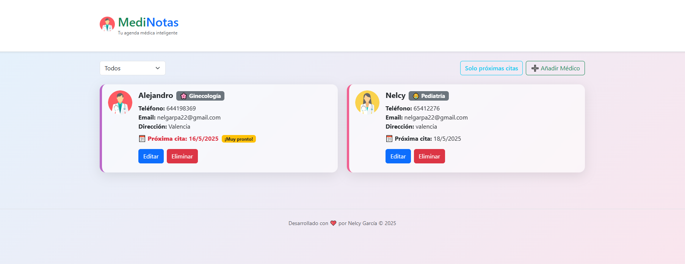

# 🩺 MediNotas

**Tu agenda médica inteligente** – Una aplicación web para registrar, organizar y gestionar tus contactos médicos con especialidad, citas y detalles importantes.

---

## 🌟 Características

- Registro de médicos por nombre, especialidad, contacto y dirección
- Visualización moderna con colores e íconos por especialidad
- Filtro por especialidad
- Botón para ver solo próximas citas
- Identificación visual por género
- Responsive: se adapta a móviles y tablets
- Diseño limpio, profesional y accesible

---

## 🖼️ Vista previa



---

## 🚀 Tecnologías usadas

- ⚛️ React + Vite
- 🎨 Bootstrap 5
- 💾 Fetch API
- 🧩 HTML5 + CSS3
- 🎯 Local/global state con `useGlobalReducer`

---


## 👩‍💻 Autora
Nelcy García
- 💻 Desarrolladora Full Stack en formación.
- 📍 Proyecto desarrollado como parte de mi crecimiento en programación frontend y diseño de interfaces.
- 🔗 [Conecta conmigo en LinkedIn](https://www.linkedin.com/in/nelcy-garcia)

----Este proyecto está bajo la licencia MIT. Puedes usarlo libremente citando a la autora.

---

## ⭐ ¿Te gusta?
¡Dale una estrella ⭐ en GitHub y compártelo en LinkedIn!
#MediNotas #React #DesarrolloWeb #Frontend #FullStack #AgendaMédica #Bootcamp

--- 

## 🛠️ Cómo ejecutar este proyecto

1. Clona el repositorio:

```bash
git clone https://github.com/Nelgarpa/Agenda_Medica.git
cd Agenda_Medica

2. Instala las dependencias:
npm run install

3. Ejecuta el servidor:
npm run dev 


